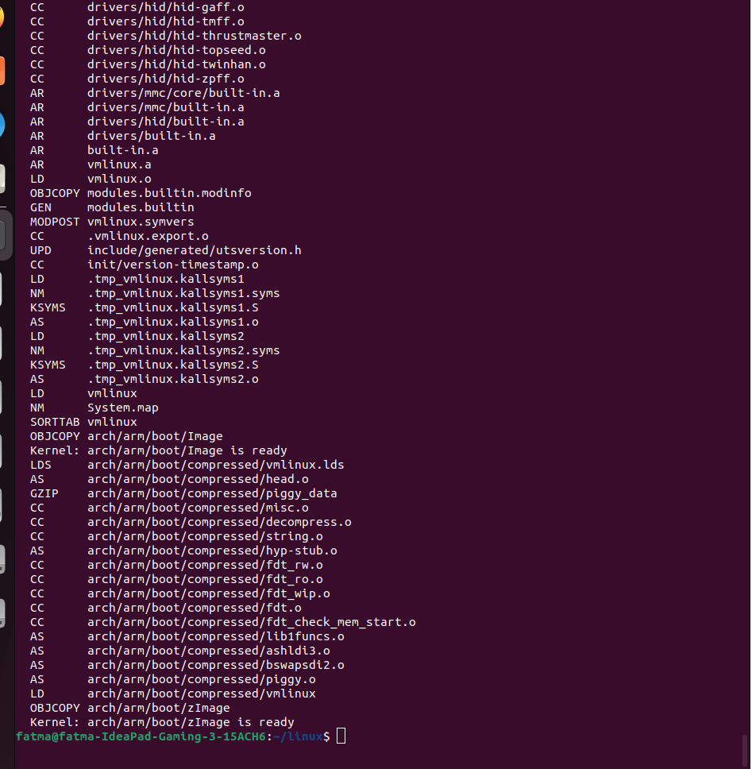
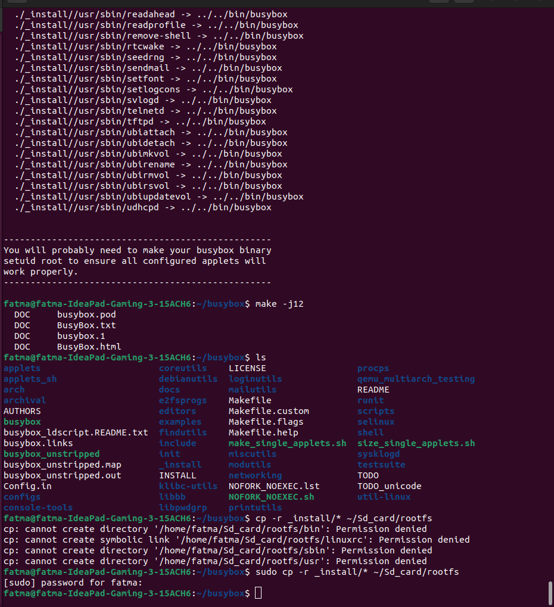
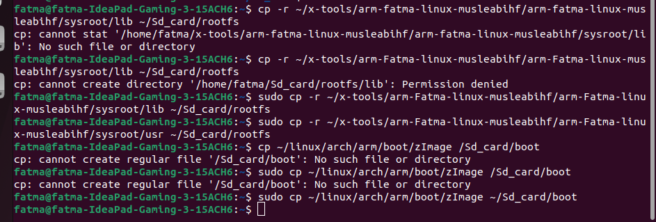
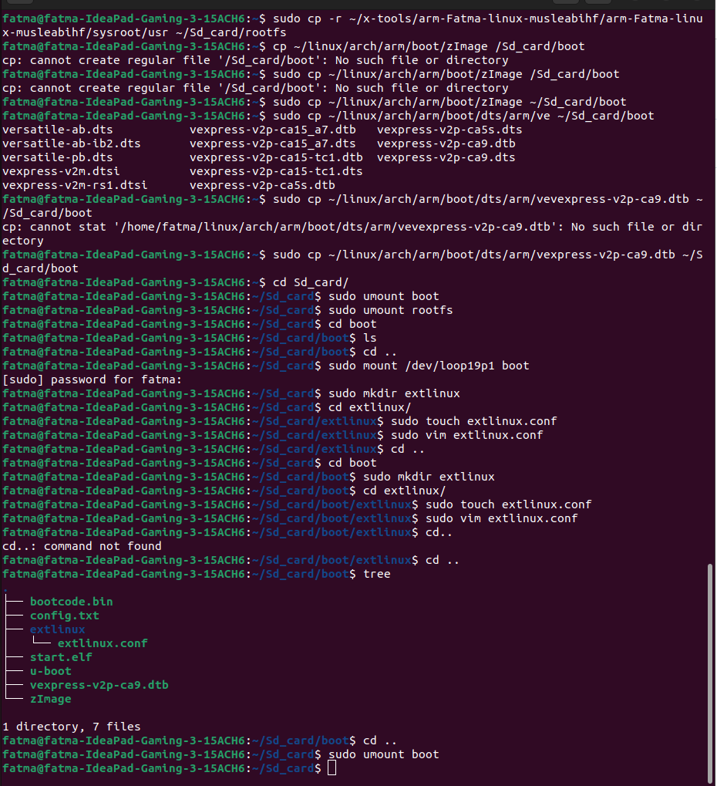
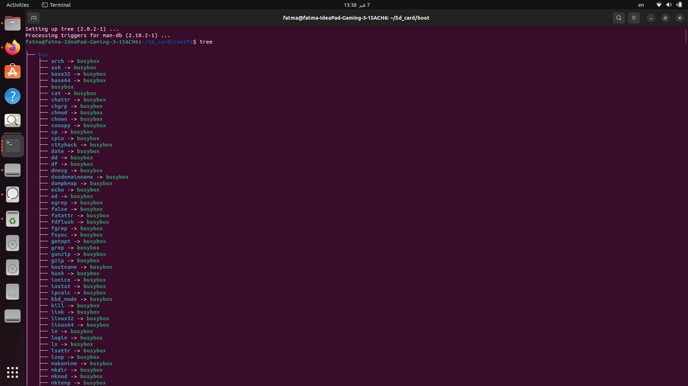
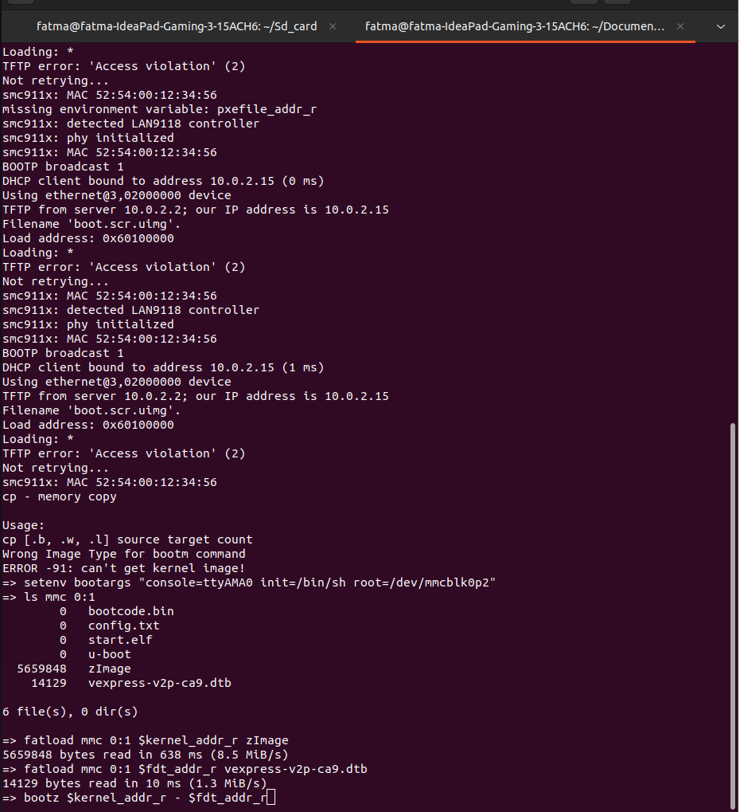
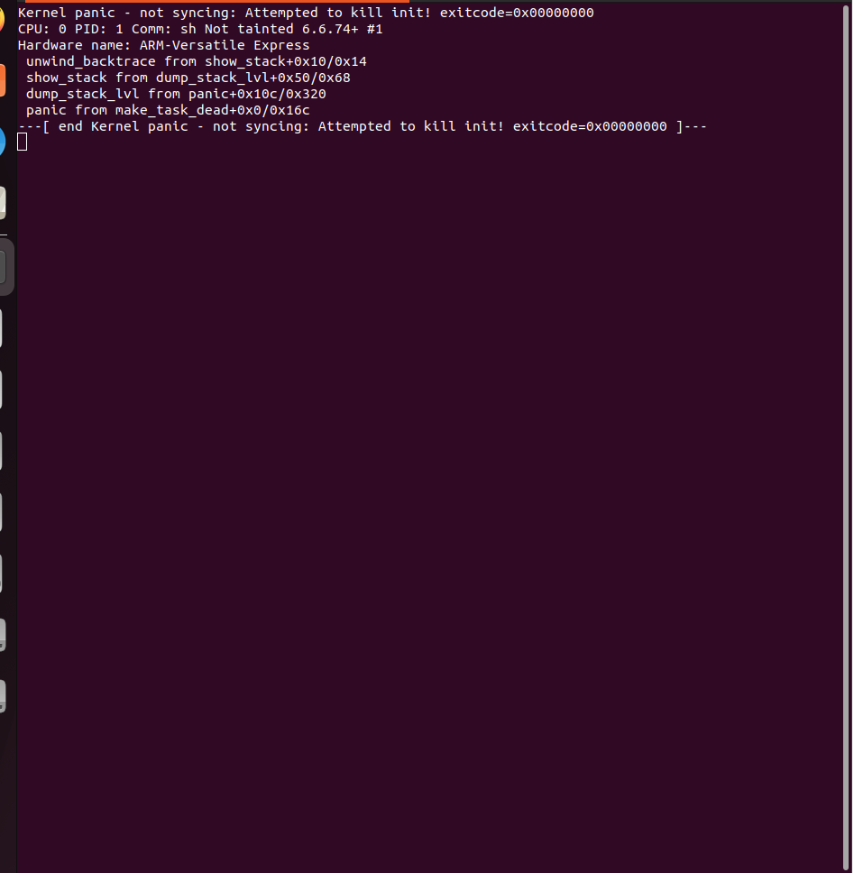

# README: Booting Linux Kernel Using QEMU and BusyBox (Virtual SD Card)  

This guide explains how to boot a Linux kernel using QEMU with a minimal root filesystem built using BusyBox. The root filesystem is stored on a **virtual SD card**, and QEMU is configured to boot from it.  

---

## Prerequisites  

Ensure you have the following installed:  

- **QEMU**  
- **GCC and essential build tools** (`build-essential`, `libncurses-dev`, etc.)  
- **Git** (for cloning repositories)  

---

## 1. Clone and Compile the Linux Kernel  

First, clone the Linux kernel source code:  

```bash
git clone --depth=1 https://github.com/torvalds/linux.git
cd linux
git checkout rpi-6.6.y 
```

Configure the kernel for **arm architecture**:  

```bash
make menuconfig
```
sets the cross-compiler path for building the kernel for ARM architecture.
```
export CROSS_COMPILE=~/x-tools/arm-fatma-linux-musleabihf/bin/arm-fatma-linux-musleabihf-
```
Compile the kernel:  

```bash
make ARCH=arm zImage dtbs modules -j$(nproc) 
```

After compilation, the **kernel image (`zImage`)** will be located at:  

```
arch/arm/boot/zImage
```
and the device tree 
```
linux/arch/arm/boot/dts/vexpress-v2p-ca9.dtb (Device Tree Blob)
```

---

## 2. Clone and Compile BusyBox  

Navigate to a working directory and clone BusyBox:  
In a minimal Linux system, BusyBox provides the essential system utilities for the root filesystem. 
BusyBox is a lightweight, single-binary collection of UNIX utilities designed for embedded systems and minimal Linux environments. It provides essential tools like ls, cd, cat, cp, echo, init, and many more—all in one small executable.

```bash
git clone https://git.busybox.net/busybox
cd busybox
git checkout 1_36_1
```

Configure BusyBox:  

```bash
make menuconfig
```


Compile and install BusyBox into the root filesystem:  

```bash
export CROSS_COMPILE=~/x-tools/arm-fatma-linux-musleabihf/bin/arm-fatma-linux-musleabihf-
make install 
make -j$(nproc)

```
This command installs BusyBox utilities into the _install/ directory.

---

## 3. Prepare the Virtual SD card 

Ensure sd.img has two partitions:
```
    loop19p1 → Mounted to boot/
    loop19p2 → Mounted to rootfs/
```

Copy Required Files

Since BusyBox is dynamically linked(I didn't use -static while compiling), include shared libraries under sysroot of the toolchain and copy them in rootfs:
```
cp -r _install/* /Sd_card/rootfs
cp -r ~/x-tools/arm-fatma-linux-musleabihf/arm-fatma-linux-musleabihf/sysroot/lib ~/Sd_card/rootfs
cp -r ~/x-tools/arm-fatma-linux-musleabihf/arm-fatma-linux-musleabihf/sysroot/usr ~/Sd_card/rootfs

cp ~/linux/arch/arm/boot/zImage /Sd_card/boot
```
This command copies the kernel image to the boot partition.



---

## 4. Run QEMU  

Now, run QEMU with the **kernel and virtual SD card**:  

```bash
- `qemu-system-arm -M ?` check all the machines 
  - `qemu-system-arm -M vexpress-a9 -kernel u-boot -nographic` choose the specified Machine 
  - `qemu-system-arm -M vexpress-a9 -kernel u-boot -nographic -sd ~/sdcard/sd.img` Accociate Qemu with the emulated SD card 
```

---
##5. Booting the Kernel
U-Boot Commands
```
setenv bootargs "console=ttyAMA0 init=/bin/sh root=/dev/mmcblk0p2"
```
This command sets kernel boot arguments to specify the console device, init process, and root filesystem.
```
fatload mmc 0:1 $kernel_addr_r zImage
```
This command loads the kernel image from the first partition into RAM.
```
fatload mmc 0:1 $fdt_addr_r vexpress-v2p-ca9.dtb
```
This command loads the device tree blob into RAM.
```
bootz $kernel_addr_r - $fdt_addr_r
```
This command boots the kernel with the provided device tree.

`init` is missing or incorrect, you will see a **kernel panic**:  

```
Kernel panic - not syncing: No working init found.
```

---


## Conclusion  

This setup boots a **custom Linux kernel** with **BusyBox** using **QEMU** and a **virtual SD card** as the root filesystem. It’s a great way to experiment with minimal Linux systems and understand embedded Linux boot processes.
