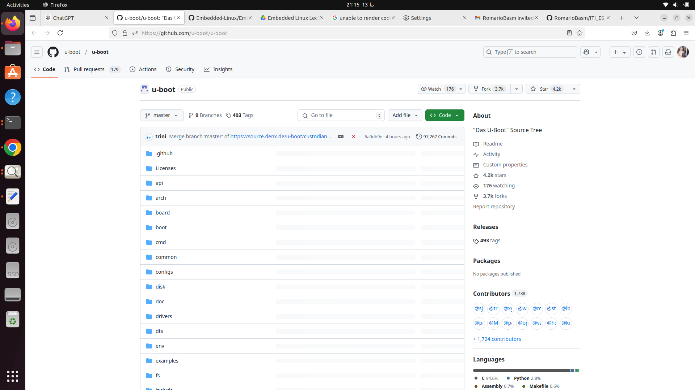
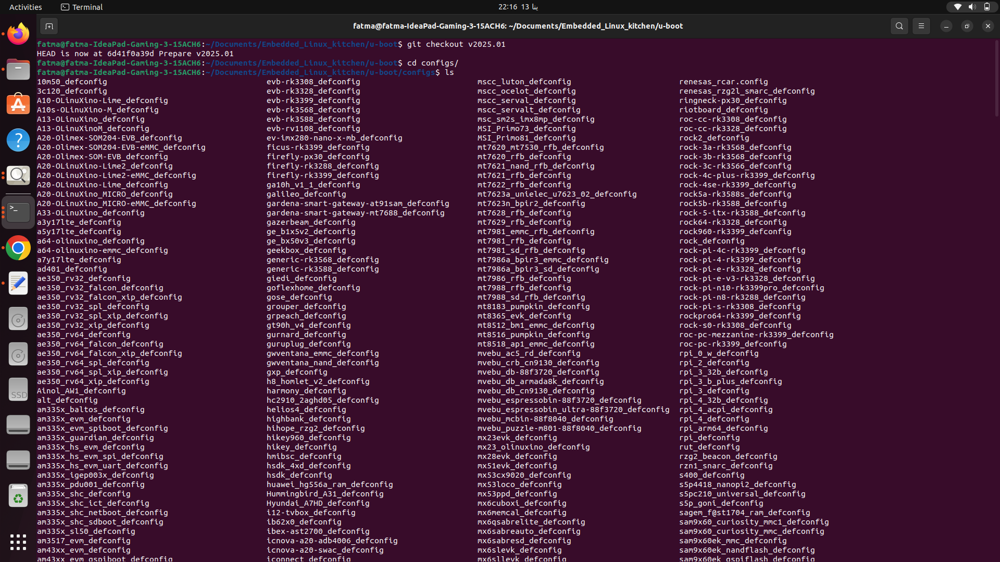
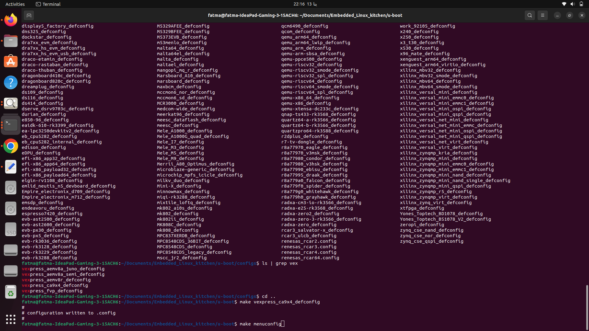
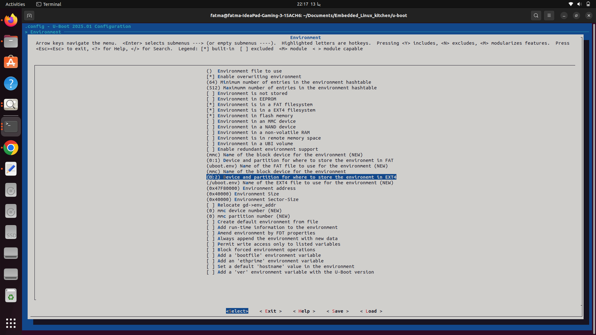
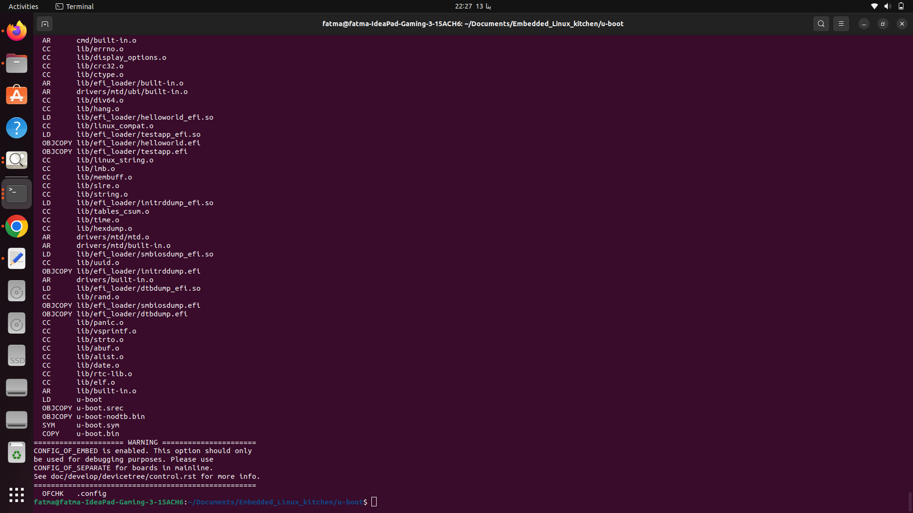
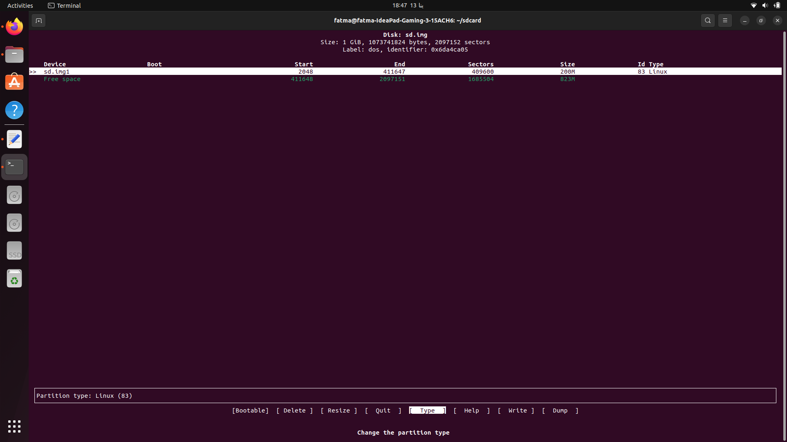
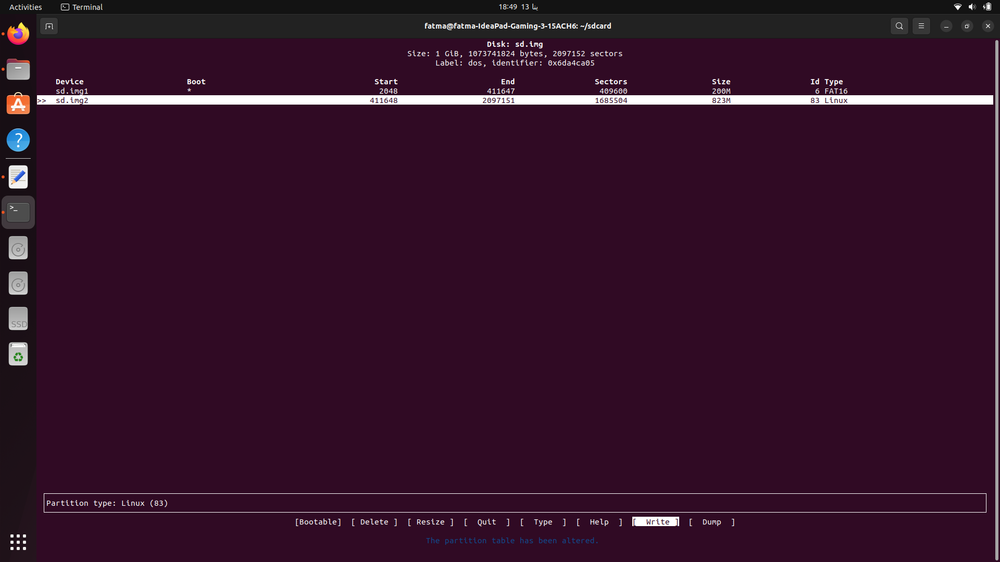
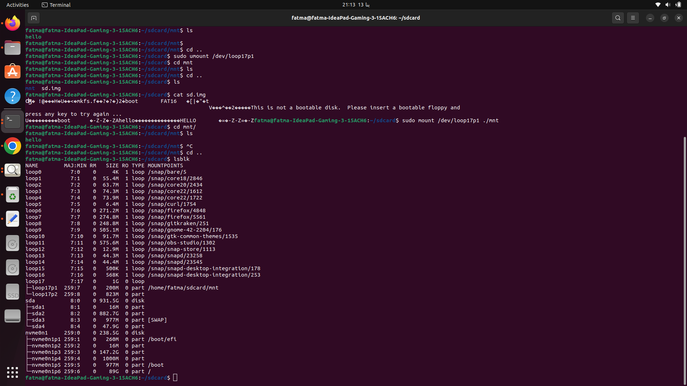

# U-Boot with QEMU and Emulated SD Card

This README provides a comprehensive guide to using U-Boot with QEMU and an emulated SD card. U-Boot (Universal Boot Loader) is a powerful boot loader widely used in embedded systems. QEMU, a versatile open-source emulator, provides an excellent platform for emulating hardware environments, including SD card usage.

## Prerequisites

Before proceeding, ensure you have the following tools installed on your system:

- **QEMU**: Emulator for running virtualized environments.
- **U-Boot Source Code**: Obtainable from [U-Boot's GitHub repository](https://github.com/u-boot/u-boot).
- **Cross-Compiler**: Suitable for the target architecture (e.g., `arm-none-eabi-gcc` for ARM).
- **dd Utility**: For creating disk images.
- **GNU Make** and **Build Essentials**: For compiling the source code.

---

## Step 1: Setting Up the U-Boot Build

1. **Clone the U-Boot Repository**:
   ```bash
   git clone https://github.com/u-boot/u-boot.git
   cd u-boot
  ```
   use v2025.01
   
   

2. **Select a Target Board**:
   Configure U-Boot for the desired target architecture (e.g., ARM).
   ```bash
   make <board_name>_defconfig
   ```
   
   
   
   Example:
   ```bash
   make qemu_arm_defconfig
   ```
   
   
3. **Build U-Boot**:
   Compile the source code using the cross-compiler.
   ```bash
   make CROSS_COMPILE=arm-none-eabi-
   ```

---

## Step 2: Creating an Emulated SD Card

### 1. Create a Virtual Disk File
The first step is to create an empty file that will act as the virtual memory card 1 GB. You can do this using the `dd` command.

```bash
sudo dd if=/dev/zero of=sd.img bs=1M count=1024
```
 
This command creates a 100 MB file named `virtual_memory_card.img`. You can adjust the size by changing the `count` value (in MB).

- `if=/dev/zero`: Specifies the input source (a file filled with zeroes).
- `of=sd.img`: Specifies the output file (your virtual memory card).
- `bs=1M`: Defines the block size (1 MB in this case).
- `count=1024`: Specifies the number of blocks to write (1 GB).

### 2. Format Different partitions of virtual sd card 

 using `cfdisk` command to create the header MBR with type `FAT16` making it bootable to carry `U-boot` with size 200Mand the second partition is the Linux Partition
 Here is the detailed Steps :
  
  
  
  
  
  
  
  
  
  
  
  
  
  
  

 Attach the virtual disk to a loop device to allow cfdisk to interact with it:
```bash
sudo losetup --partscan-f sd.img
```
    -f: Finds an available loop device.
    
  
    in my case the virtual disk attached to loop17    
### 3. Format the Virtual Memory Card
Next, format the virtual memory card using the `mkfs` command. You can choose any filesystem type. Below, we use `vfat`:

```bash
sudo mkfs.vfat -F 16 -n boot /dev/loop17p1
```

This creates an vfat filesystem within the `sd.img` file. You can replace `vfat` with other filesystems like `ext4` or `ntfs` based on your needs.

### 4. Create a Mount Point
Create a directory to mount the virtual memory card.

```bash
mkdir /mnt
```

This will be the mount point for the virtual memory card.

### 5. Mount the Virtual Memory Card
Now, mount the virtual memory card to the directory you created.

```bash
sudo mount /dev/loop17p1 ./mnt

```
- `/mnt`: The directory where the virtual memory card will be mounted.


### 7. Unmount the Virtual Memory Card
Once you're done using the virtual memory card, unmount it with the following command:

```bash
sudo umount /dev/loop17p1 
```





## Step 3: Running U-Boot in QEMU

1. **Launch QEMU**:
   Use the appropriate QEMU command to emulate the target architecture and attach the SD card.
   ```bash
   qemu-system-arm -M versatilepb -m 128M -nographic -sd sdcard.img -kernel u-boot
   ```

2. **Interact with U-Boot**:
   Once QEMU starts, you should see the U-Boot console.
   ```
   U-Boot 2023.01 (Jan 01 2023 - 00:00:00 +0000)
   U-Boot >
   ```

3. **Test SD Card Functionality**:
   Verify that U-Boot detects the SD card.
   ```
   U-Boot > mmc list
   U-Boot > mmc info
   ```

---

## Troubleshooting

- **Compilation Errors**: Ensure the correct cross-compiler is installed and in your system's PATH.
- **Partition Offset Issues**: Use tools like `losetup` to determine the correct offset.
- **QEMU Errors**: Verify QEMU is installed and supports the emulated board.

---


