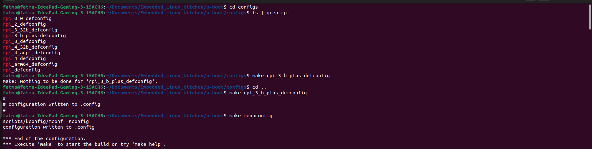
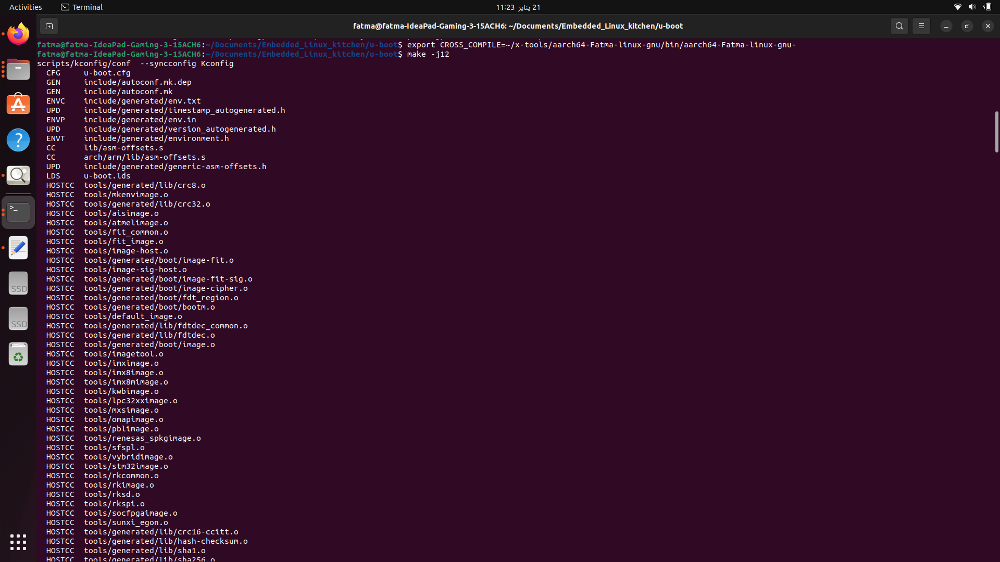
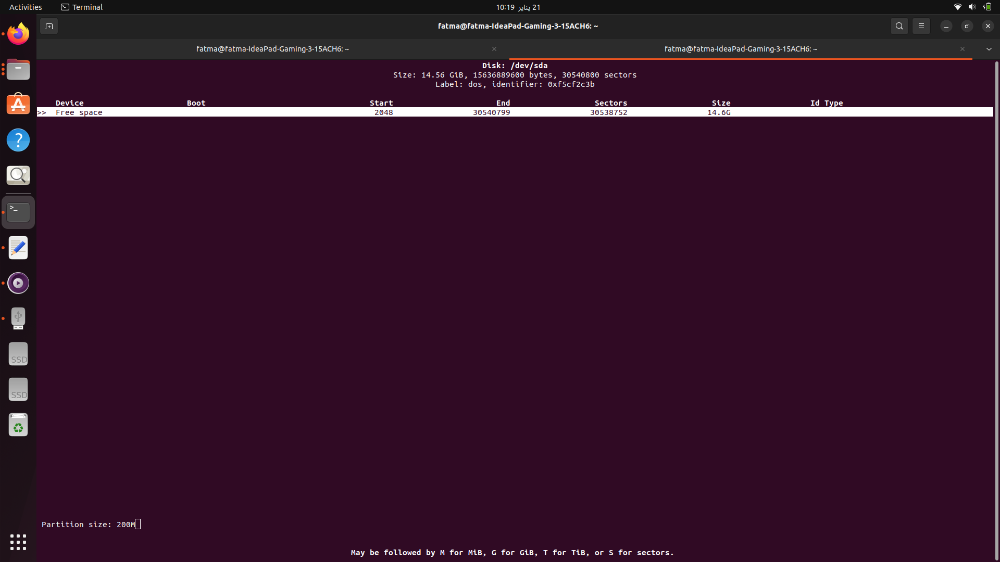
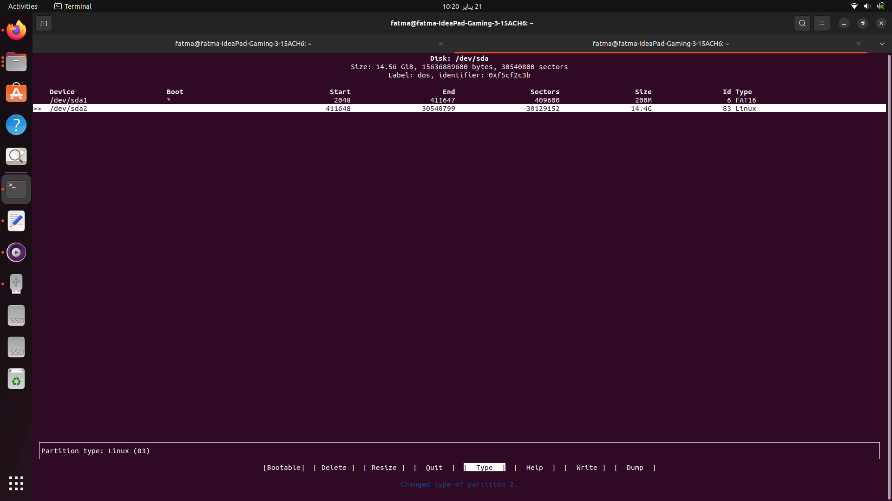
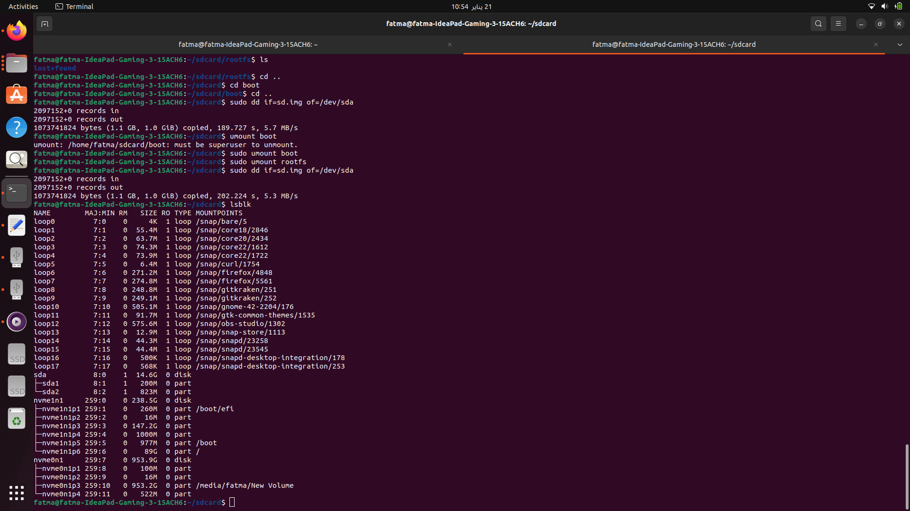

# README: Using U-Boot with a Physical SD Card on Raspberry Pi 3 (RPi3)

## Overview

This guide explains how to set up and use U-Boot as a bootloader on a physical SD card for the Raspberry Pi 3 (RPi3). It utilizes a custom toolchain created using **crosstool-NG** for cross-compilation and **minicom** for serial communication.

---

## Prerequisites

### 1. Hardware
- Raspberry Pi 3 (RPi3)
- SD card (minimum 4GB)
- SD card reader/writer
- USB-to-UART adapter (for serial debugging)
- Power supply for RPi3

### 2. Software
- **Custom toolchain** built using [crosstool-NG](https://crosstool-ng.github.io/):
  - Ensure the toolchain is configured for `aarch64`.
- **Minicom** for serial communication.
- Tools: `fdisk`, `mkfs.fat`, and `dd`.
- A Linux system for preparing the SD card and interacting with the RPi3.

### 3. System
- A Linux development machine where the custom toolchain is installed.
- Serial console access via **minicom**.

---

## Steps to Set Up U-Boot on a Physical SD Card

### 1. Build U-Boot

1. Clone the U-Boot repository:
   ```bash
   git clone https://github.com/u-boot/u-boot.git
   cd u-boot
   ```

2. Configure U-Boot for the Raspberry Pi 3:
   ```bash
   make rpi_3_defconfig CROSS_COMPILE=<toolchain-prefix>
   ```

   Replace `<toolchain-prefix>` with the prefix of your custom toolchain (e.g., `aarch64-fatma-linux-gnueabihf-`).

3. Build U-Boot:
   ```bash
   make -j$(nproc) CROSS_COMPILE=<toolchain-prefix>
   ```

   The compiled U-Boot binary will be in the `u-boot.bin` file.
   
   
   
---

### 2. Prepare the SD Card

1. Insert the SD card into your Linux system and identify its device (e.g., `/dev/sdX`):
   ```bash
   lsblk
   ```
using `sudo dmesg`
 
2. Partition the SD card:
   ```bash
   sudo cfdisk /dev/sdX
   ```
   You can configure it by your self 
   - Delete existing partitions if necessary.
   - Create a new primary partition.
   - Set the partition type to `FAT 16` (Code: `c`).
   - Create a new extended partition.
   - Set the partition type to `Linux` (Code: `c`).
   - Write changes and exit.

3. Format the partitions using mkfs
   
---

### 3. Install U-Boot on the SD Card

1. Mount the FAT16 partition:
   ```bash
   sudo mount /dev/sdX1 boot
   ```
   Mount the Linux partition:
   ```bash
   sudo mount /dev/sdX2 rootfs
   ```
3. Unmount the SD card:
   ```bash
   sudo umount boot
   sudo umount rootfs
   ```
   
    
    
    
    
---
or You can cloning the emulated SDcard 

---
###4.Adding The fireware files to the Sd card 


### 5. Set Up Minicom for Serial Debugging

1. Connect the USB-to-UART adapter to the Raspberry Pi's GPIO pins:
   - Pin 6 (GND) → GND of the adapter.
   - Pin 8 (TXD) → RX of the adapter.
   - Pin 10 (RXD) → TX of the adapter.

2. Find the USB serial port:
   ```bash
   dmesg | grep tty
   ```

3. Configure **minicom**:
   ```bash
   sudo minicom -s
   ```
   - Set the serial device to `/dev/ttyUSB0` (or the detected device).
   - Set the baud rate to `115200`.
   - Disable hardware and software flow control.

   Save the configuration and start **minicom**:
   ```bash
   minicom
   ```

---

### 5. Boot U-Boot on the RPi3

1. Insert the prepared SD card into the RPi3.

2. Power on the RPi3. You should see the U-Boot prompt in **minicom**:
   ```
   U-Boot>
   ```

---


## Troubleshooting

- **Toolchain Issues**: Ensure your custom toolchain matches the RPi3's architecture (e.g., ARM Cortex-A53).
- **No Output in Minicom**: Verify GPIO connections and check the serial port settings.
- **Boot Failure**: Confirm the SD card partitioning and file placement.

---


