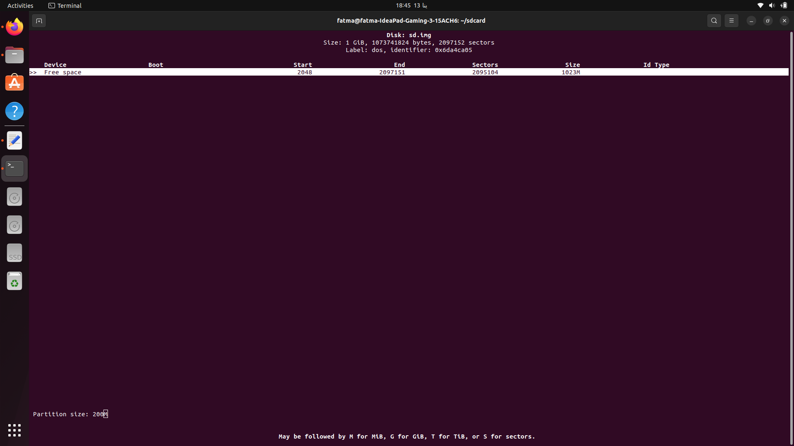
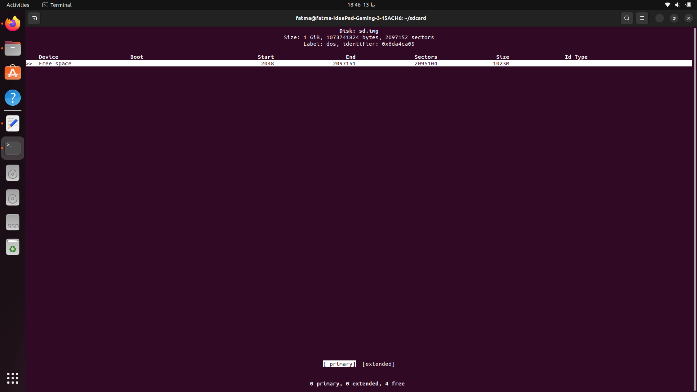
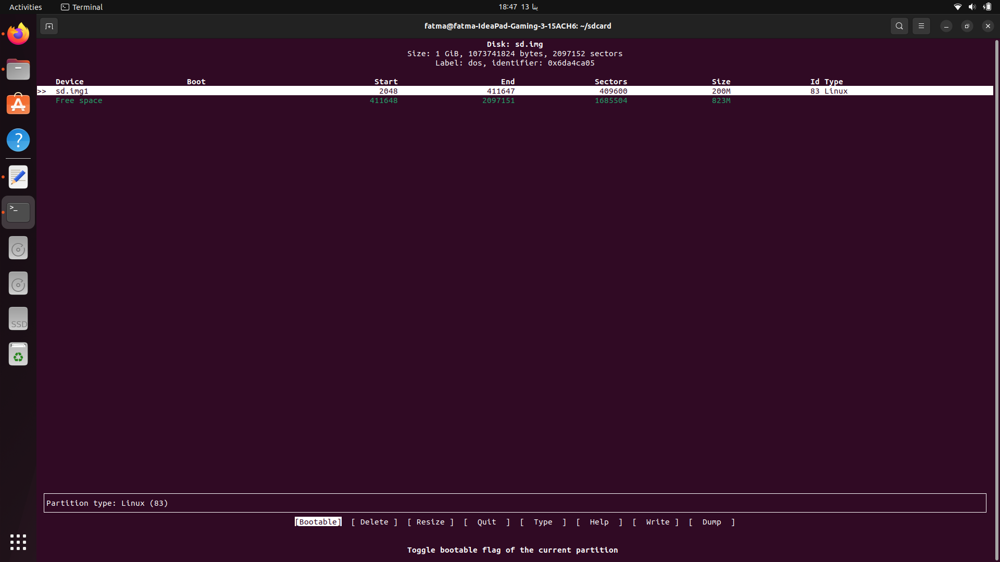
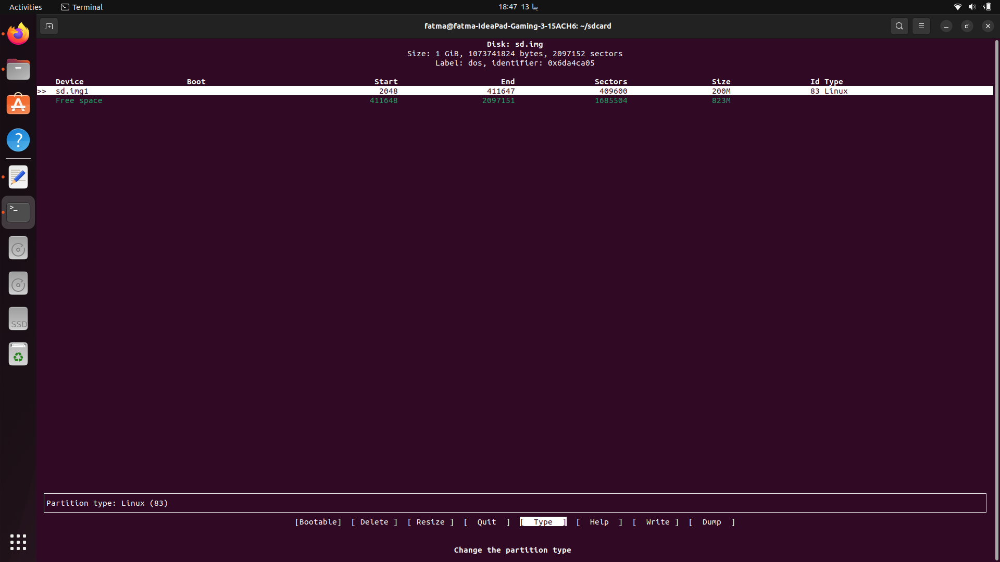
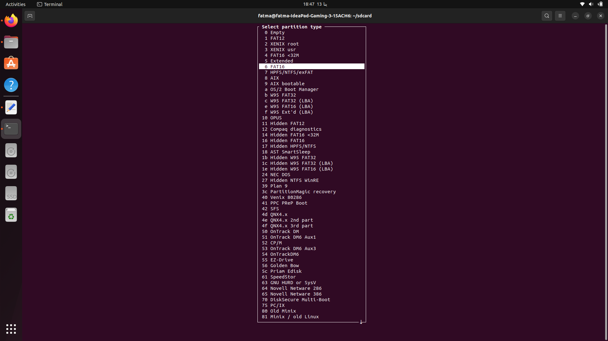
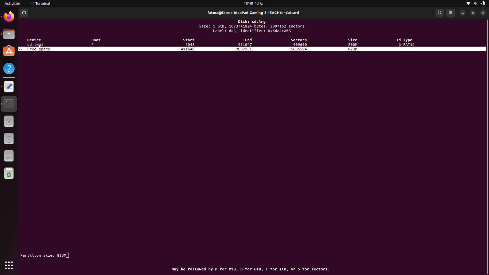
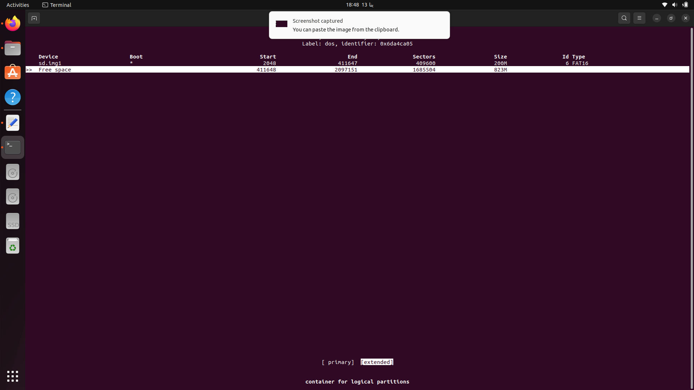
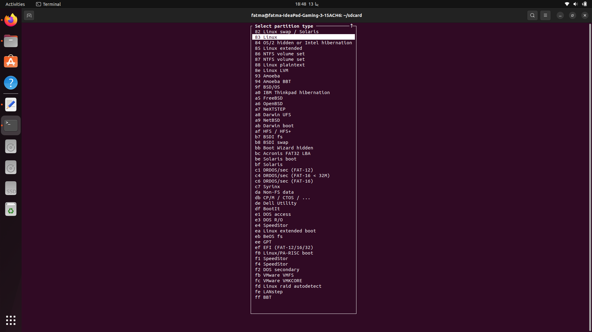
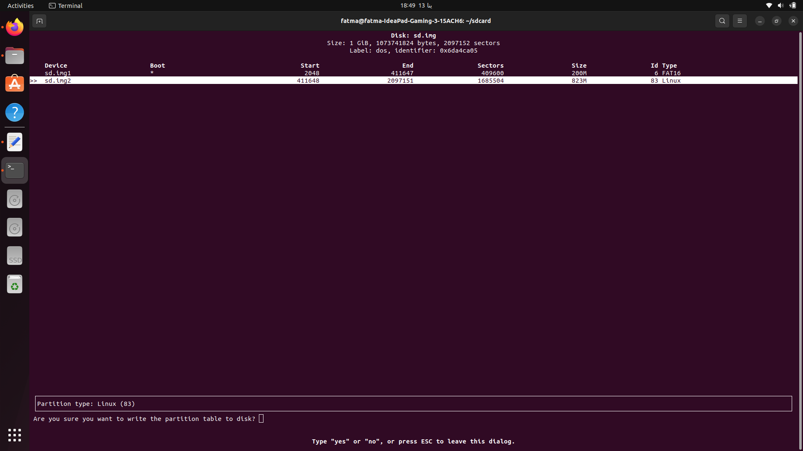
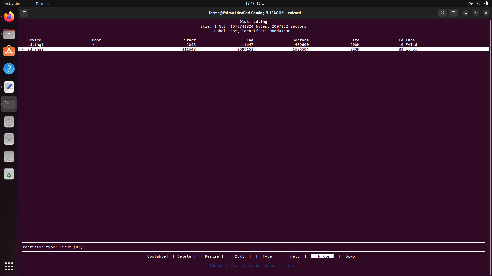

# Virtual Memory Card Creation on Linux

This guide demonstrates how to create and mount a virtual memory card using Linux commands. A virtual memory card simulates the functionality of a real storage device, which can be used to store and transfer data as a regular memory card would.

## Prerequisites

Before proceeding, ensure you have the following:

- A Linux-based system (tested on Ubuntu).
- `dd` and `mkfs` commands installed (usually pre-installed on most distributions).
- Root or sudo privileges to perform system-level operations.

## Steps to Create a Virtual Memory Card

### 1. Create a Virtual Disk File
The first step is to create an empty file that will act as the virtual memory card 1 GB. You can do this using the `dd` command.

```bash
sudo dd if=/dev/zero of=sd.img bs=1M count=1024
```
 
This command creates a 100 MB file named `virtual_memory_card.img`. You can adjust the size by changing the `count` value (in MB).

- `if=/dev/zero`: Specifies the input source (a file filled with zeroes).
- `of=sd.img`: Specifies the output file (your virtual memory card).
- `bs=1M`: Defines the block size (1 MB in this case).
- `count=1024`: Specifies the number of blocks to write (1 GB).

### 2. Format Different partitions of virtual sd card 

 using `cfdisk` command to create the header MBR with type `FAT16` making it bootable to carry `U-boot` with size 200Mand the second partition is the Linux Partition
 Here is the detailed Steps :
  
  
  
  
  
  
  
  
  
  
  
  
  

 Attach the virtual disk to a loop device to allow cfdisk to interact with it:
```bash
sudo losetup -f sd.img
```
    -f: Finds an available loop device.
### 3. Format the Virtual Memory Card
Next, format the virtual memory card using the `mkfs` command. You can choose any filesystem type. Below, we use `ext4`:

```bash
sudo mkfs.ext4 sd.img
```

This creates an ext4 filesystem within the `virtual.img` file. You can replace `ext4` with other filesystems like `vfat` or `ntfs` based on your needs.

### 4. Create a Mount Point
Create a directory to mount the virtual memory card.

```bash
mkdir /mnt/virtual_memory_card
```

This will be the mount point for the virtual memory card.

### 5. Mount the Virtual Memory Card
Now, mount the virtual memory card to the directory you created.

```bash
sudo mount -o loop virtual_memory_card.img /mnt/virtual_memory_card
```

- `-o loop`: Tells the system to treat the file as a block device.
- `/mnt/virtual_memory_card`: The directory where the virtual memory card will be mounted.

### 6. Access and Use the Virtual Memory Card
Your virtual memory card is now mounted and ready for use. You can now copy, move, and delete files just like with a real memory card.

For example, you can copy a file to the virtual memory card:

```bash
cp sample.txt /mnt/virtual_memory_card
```

### 7. Unmount the Virtual Memory Card
Once you're done using the virtual memory card, unmount it with the following command:

```bash
sudo umount /mnt/virtual_memory_card
```

### 8. (Optional) Remove the Virtual Memory Card File
If you no longer need the virtual memory card, you can delete the image file:

```bash
rm virtual_memory_card.img
```

## Conclusion

You have successfully created a virtual memory card on Linux using simple commands. This virtual card can be used to simulate storage devices for various purposes, such as testing, development, or transferring data.

---

Let me know if you need any modifications or additional details!
